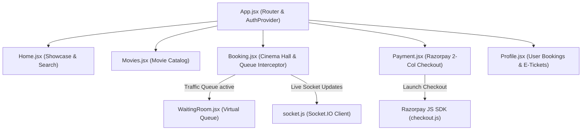

# 💻 CinePulse Client: Detailed Architecture & User Flow Documentation

This directory contains the React 18 frontend for **CinePulse**, built with Vite, SCSS Modules, Socket.IO WebSockets client, and Razorpay JS SDK.

---

## 📑 Table of Contents
1. [Frontend Architecture](#-frontend-architecture)
2. [User Journeys & Component Lifecycle](#-user-journeys--component-lifecycle)
3. [Client-Side Failure Modes & Self-Healing](#-client-side-failure-modes--self-healing)
4. [Component Directory Structure](#-component-directory-structure)

---

## 🏗️ Frontend Architecture



---

## 🔄 User Journeys & Component Lifecycle

### 1. Landing & Navigation (`/` & `/movies`)
- Users browse featured shows across Movies, Concerts, Standup Comedy, and Broadway Musicals.
- Clicking any show passes title, hall, time, and poster metadata via React Router query parameters.

### 2. Virtual Waiting Room Interceptor (`/booking`)
- On mount, `Booking.jsx` executes `POST /api/queue/join`.
- If response is `QUEUED`, renders `<WaitingRoom />`.
- `<WaitingRoom />` joins `user:<userId>` Socket.IO room and listens for `queue:granted`.
- When turn is reached, `<WaitingRoom />` invokes `onAccessGranted(token)` and seamlessly reveals seat selection!

### 3. Interactive Seat Selection (`/booking`)
- Displays dual row indicators, aisle walkway gaps, ticket quantity picker (`1`, `2`, `3`, `4`), and plush 3D chair headrests (`.headrest`).
- Clicking an available seat calls `POST /api/book-seat`, setting Redis `HOLD` (120s TTL).
- Real-time WebSocket listener updates seat status across all connected browsers instantly.

### 4. Razorpay Checkout & Order Summary (`/payment`)
- Displays a 2-column wide layout (`max-width: 880px`) with movie showcase card and pass holder input form.
- Real-time countdown timer calculates remaining seconds using `expiresAtTimestamp` in `localStorage`.
- Submitting the form calls `/api/pay/create-order` and opens the official **Razorpay Checkout Modal**.
- On successful payment, renders the confirmed **E-Ticket Pass** with Razorpay Payment ID.

### 5. User Bookings & E-Tickets (`/profile`)
- Displays authenticated user profile header and confirmed E-Ticket passes with show metadata and venue details.

---

## ⚠️ Client-Side Failure Modes & Self-Healing

| Client Scenario | Impact | Self-Healing / Handling |
| :--- | :--- | :--- |
| **Page Refresh During 120s Hold** | In-memory React state wipes. | Reads `seat_hold_expires_<bookingId>` from `localStorage` and resumes timer at exact remaining seconds. |
| **WebSocket Connection Drop** | Real-time seat updates pause. | Socket.IO client auto-reconnects with `reconnectionAttempts: Infinity` and re-syncs state. |
| **Network Loss in Waiting Room** | Cannot receive socket events. | Displays pulsing banner *"⚡ Connection Lost • Reconnecting..."* and re-joins queue room upon reconnection. |
| **Razorpay SDK CDN Failure** | Checkout script fails to load. | Displays toast error *"Razorpay SDK failed to load. Check network connection"* and restores button state. |
| **120s Timer Expiry During Payment** | Seats release on server. | Programmatically closes Razorpay iframe, clears DOM containers, and transitions to Expired Reservation screen. |

---

## 📁 Component Directory Structure

```
client/
├── src/
│   ├── components/
│   │   ├── Navbar/            # Navigation header & Auth modal trigger
│   │   ├── AuthModal/         # Login / Registration form
│   │   └── WaitingRoom/       # Virtual Queue Component (Progress ring & rank display)
│   ├── pages/
│   │   ├── home/              # Landing page hero & movie categories
│   │   ├── movies/            # Movies catalog page
│   │   ├── booking/           # Interactive Cinema Hall seat picker
│   │   ├── payment/           # 2-Column Razorpay Checkout & E-Ticket
│   │   └── profile/           # User Bookings profile
│   ├── context/               # AuthContext (JWT Authentication state)
│   ├── lib/                   # socket.js, toast.js
│   └── data/                  # Mock movies dataset
├── index.html
└── package.json
```
