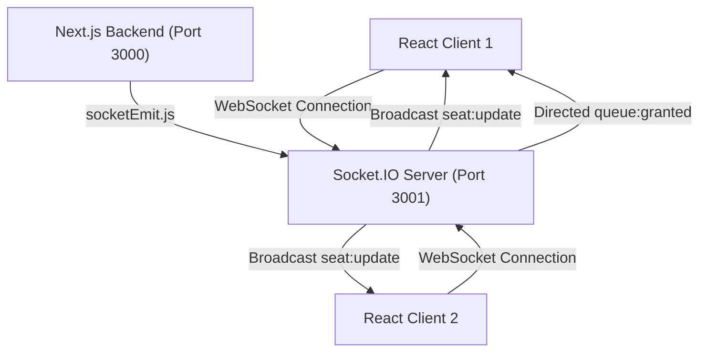

# 🔌 CinePulse Socket Server & HTTP Proxy (Port 3001)

This directory contains the standalone Node.js **Socket.IO WebSockets Server & HTTP Proxy** for **CinePulse**. It provides real-time event broadcasting (seat updates, queue promotions) and proxies REST API traffic to the Next.js backend.

---

## 🏗️ Server Architecture



---

## ⚙️ Key Technical Features

1. **Standalone Port Isolation (Port 3001)**: Runs on dedicated HTTP server decoupled from Next.js serverless app router to maintain persistent WebSocket connections.
2. **Reverse Proxying**: Uses `http-proxy` to proxy REST API requests from `http://localhost:3001/api` directly to Next.js API server (`http://localhost:3000`).
3. **Heartbeat & Tab-Throttling Protection**:
   - `pingTimeout: 60000` (60s timeout before considering socket dead)
   - `pingInterval: 25000` (25s heartbeat ping interval)
   - Prevents background tab throttling in Chrome/Edge from causing unexpected disconnects.
4. **Room-Based Channel Routing**:
   - `event:${eventId}`: Broad-scoped event rooms for cinema hall seat updates.
   - `user:${userId}`: Targeted user rooms for private queue promotion notifications (`queue:granted`).

---

## 📡 WebSockets Event Specification

| Event Name | Direction | Payload | Description |
| :--- | :--- | :--- | :--- |
| `join:event` | Client ➔ Server | `{ eventId }` | Client joins cinema hall event room. |
| `leave:event` | Client ➔ Server | `{ eventId }` | Client leaves cinema hall event room. |
| `join:user_queue` | Client ➔ Server | `{ userId }` | Client joins private queue room for rank notifications. |
| `seat:update` | API ➔ Server ➔ All | `{ seatId, status, ts }` | Broadcasts live seat state (`AVAILABLE`, `HELD`, `BOOKED`) to all connected clients. |
| `queue:granted` | API ➔ Server ➔ User | `{ userId, token, eventId }` | Sends instant private access token to promoted user in line. |

---

## 🚀 Running the Socket Server Locally

```bash
# Install dependencies
npm install

# Start server
node server.js
```
